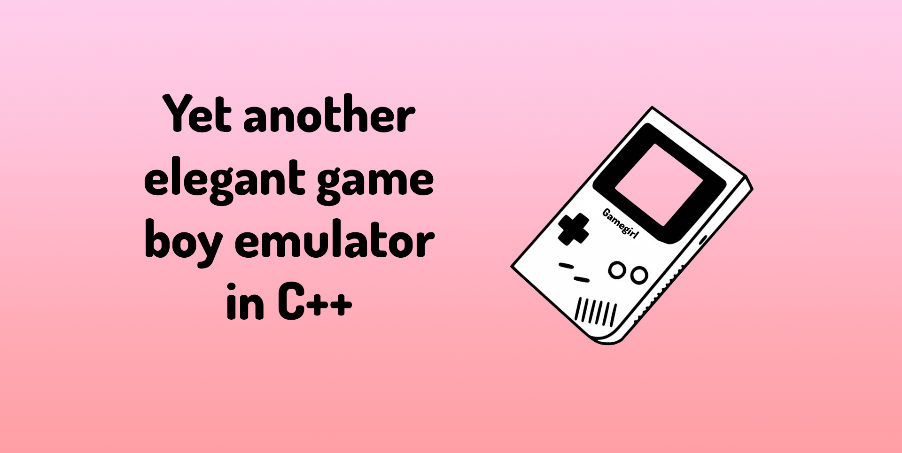

# GameGirl

<p align="center">
  
  
  
</p>

<p align="center">
  
</p>

## Build
```sh
make
```

## Run
```sh
./GameGirl rom.gba
```

## Tests
```sh
./GameGirl run_tests
```

## Todo
- [x] Read all assembly opcodes
- [x] Register all opcodes
- [ ] Fix all warning
- [X] Link all uint16_t registers to unit8_t
- [ ] Bind opcode to pointer function
- [ ] Implement GUI with OpenGL
- [ ] Intercept user Input
- [ ] Intercept user Output
- [ ] Implement all CPU actions
- [ ] Implement all register interactions

### Contributors

<a href="https://github.com/Neotoxic-off/GameGirl/graphs/contributors">
  
</a>

### Resources
- https://hacktix.github.io/GBEDG/
